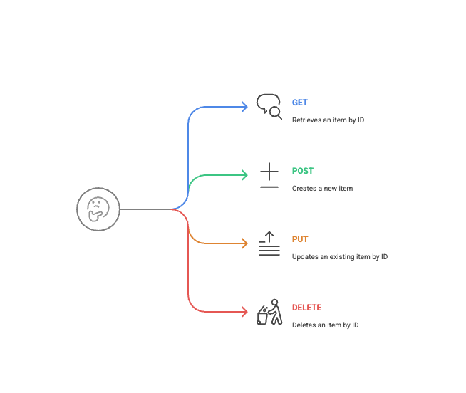

Output:



# Run the application

- `go run main.go || air`

# Folder Structure:

```bash
go-gin-postgres-local/
│
├── controllers/
│   └── item_controller.go
│
├── models/
│   └── item.go
│
├── routes/
│   └── item_routes.go
│
├── config/
│   └── db.go
│
├── main.go
│
└── go.mod


```

# Go Gin PostgreSQL Local API

This project demonstrates how to build a simple REST API using Go with the Gin framework, connecting to a locally installed PostgreSQL database. It includes features like automatic table creation on startup, colored console logging for better readability, and live reloading for an improved development experience.

## Features

*   **Connects to a local PostgreSQL database.**
*   Uses the **Gin framework for routing and request handling.**
*   Defines a simple `Item` model and CRUD-like API endpoints (`/items`).
*   **Automatic Table Creation**: The `items` table is created automatically if it doesn't exist when the server starts.
*   **Colored Console Output**: Important server logs (connection success, server start, Gin messages) are color-coded for easier debugging.
*   **Live Reloading**: Uses `air` | `gin` to automatically restart the server on code changes.

    - go install github.com/air-verse/air@latest
    - air

## Prerequisites


*   **Go**: Version 1.18 or newer.
*   **PostgreSQL**: Installed and running locally (not via Docker as per the final setup).
*   **`air` (for live reload)**: Go live reload tool.

## 1. PostgreSQL Setup (Local Instance)

1.  **Install PostgreSQL** on your operating system if you haven't already.
2.  Ensure the PostgreSQL service is running.
3.  Connect to PostgreSQL as a superuser (e.g., `postgres`):
    ```bash
    psql -U postgres
    ```
4.  Create a database (e.g., `foodie`):
    ```sql
    CREATE DATABASE foodie;
    ```
5.  Create a user and grant privileges (e.g., user `postgres` with password `postgres` for simplicity in this example, or create a dedicated user):
    ```sql
    -- If using the existing 'postgres' user, ensure its password is set or you know it.
    -- To create a new user:
    -- CREATE USER myappuser WITH PASSWORD 'securepassword';
    -- GRANT ALL PRIVILEGES ON DATABASE foodie TO myappuser;
    ```
    *For this project, we ended up using the default `postgres` user with password `postgres` and database `foodie`.*

## 2. Go Project Setup

1.  Create a project directory:
    ```bash
    mkdir go-gin-postgres-local
    cd go-gin-postgres-local
    ```

2.  Initialize Go modules:
    ```bash
    go mod init go-gin-postgres-local
    ```

3.  Get necessary Go packages:
    ```bash
    go get github.com/gin-gonic/gin
    go get github.com/lib/pq  # PostgreSQL driver
    ```

## 3. Application Code (`main.go`)

Create a `main.go` file with the following content. This version includes database connection, schema initialization, colored logging, and Gin handlers.

```go
package main

import (
	"database/sql"
	"fmt"
	"io"
	"log"
	"net/http"
	"os"
	"strings"

	"github.com/gin-gonic/gin"
	_ "github.com/lib/pq" // The PostgreSQL driver
)

// ANSI Color Codes
const (
	ColorReset  = "\033[0m"
	ColorGreen  = "\033[32m"
	ColorYellow = "\033[33m"
	ColorBlue   = "\033[34m"
	ColorRed    = "\033[31m"
)

var db *sql.DB

type Item struct {
	ID       int    `json:"id"`
	Name     string `json:"name"`
	Quantity int    `json:"quantity"`
}

// Function to initialize the database schema
func initializeSchema(db *sql.DB) error {
	createTableSQL := `
	CREATE TABLE IF NOT EXISTS items (
		id SERIAL PRIMARY KEY,
		name VARCHAR(100) NOT NULL,
		quantity INTEGER
	);`
	_, err := db.Exec(createTableSQL)
	if err != nil {
		return fmt.Errorf("error creating items table: %w", err)
	}
	log.Println(ColorGreen + "Items table checked/created successfully." + ColorReset)
	return nil
}

// Custom writer to colorize Gin's specific output lines
type ginColorWriter struct {
	writer io.Writer
}

func (w *ginColorWriter) Write(p []byte) (n int, err error) {
	s := string(p)
	if strings.Contains(s, "[GIN-debug] Listening and serving HTTP on") || strings.Contains(s, "Listening and serving HTTP on") {
		s = ColorGreen + s + ColorReset
	} else if strings.Contains(s, "[GIN-debug] [WARNING]") {
		s = ColorYellow + s + ColorReset
	} else if strings.Contains(s, "[GIN-debug] GET") || strings.Contains(s, "[GIN-debug] POST") {
		s = ColorBlue + s + ColorReset
	}
	return w.writer.Write([]byte(s))
}

func main() {
	dbHost := getEnv("DB_HOST", "localhost")
	dbPort := getEnv("DB_PORT", "5432")
	dbUser := getEnv("DB_USER", "postgres")   // Adjusted to 'postgres'
	dbPassword := getEnv("DB_PASSWORD", "postgres") // Adjusted to 'postgres'
	dbName := getEnv("DB_NAME", "foodie")     // Adjusted to 'foodie'
	sslMode := getEnv("DB_SSLMODE", "disable")

	connStr := fmt.Sprintf("host=%s port=%s user=%s password=%s dbname=%s sslmode=%s",
		dbHost, dbPort, dbUser, dbPassword, dbName, sslMode)

	var err error
	db, err = sql.Open("postgres", connStr)
	if err != nil {
		log.Fatalf(ColorRed+"Error opening database: %v"+ColorReset, err)
	}
	defer db.Close()

	err = db.Ping()
	if err != nil {
		log.Fatalf(ColorRed+"Error connecting to database: %v. Check connection string and if PostgreSQL is running."+ColorReset, err)
	}
	log.Println(ColorGreen + "Successfully connected to local PostgreSQL!" + ColorReset)

	if err := initializeSchema(db); err != nil {
		log.Fatalf(ColorRed+"Error initializing database schema: %v"+ColorReset, err)
	}

	coloredGinDefaultWriter := &ginColorWriter{writer: os.Stdout}
	gin.DefaultWriter = coloredGinDefaultWriter
	// gin.DefaultErrorWriter = &ginColorWriter{writer: os.Stderr} // Optionally color Gin errors too

	router := gin.Default()

	router.GET("/items", getItems)
	router.GET("/items/:id", getItem)
	router.POST("/items", createItem)

	log.Println(ColorGreen + "Starting server on :8080" + ColorReset)
	if err := router.Run(":8080"); err != nil {
		log.Fatalf(ColorRed+"Failed to run server: %v"+ColorReset, err)
	}
}

func getEnv(key, fallback string) string {
	if value, ok := os.LookupEnv(key); ok {
		return value
	}
	return fallback
}

// --- Gin Handlers ---
func getItems(c *gin.Context) {
	rows, err := db.Query("SELECT id, name, quantity FROM items")
	if err != nil {
		log.Printf(ColorRed+"Error querying items: %v"+ColorReset, err)
		c.JSON(http.StatusInternalServerError, gin.H{"error": "Failed to retrieve items"})
		return
	}
	defer rows.Close()
	items := []Item{}
	for rows.Next() {
		var item Item
		if err := rows.Scan(&item.ID, &item.Name, &item.Quantity); err != nil {
			log.Printf(ColorRed+"Error scanning item row: %v"+ColorReset, err)
			c.JSON(http.StatusInternalServerError, gin.H{"error": "Failed to process item data"})
			return
		}
		items = append(items, item)
	}
	if err = rows.Err(); err != nil {
		log.Printf(ColorRed+"Error after iterating rows: %v"+ColorReset, err)
		c.JSON(http.StatusInternalServerError, gin.H{"error": "Error processing item results"})
		return
	}
	c.JSON(http.StatusOK, items)
}

func getItem(c *gin.Context) {
	id := c.Param("id")
	var item Item
	row := db.QueryRow("SELECT id, name, quantity FROM items WHERE id = $1", id)
	err := row.Scan(&item.ID, &item.Name, &item.Quantity)
	if err != nil {
		if err == sql.ErrNoRows {
			c.JSON(http.StatusNotFound, gin.H{"error": "Item not found"})
		} else {
			log.Printf(ColorRed+"Error querying single item: %v"+ColorReset, err)
			c.JSON(http.StatusInternalServerError, gin.H{"error": "Failed to retrieve item"})
		}
		return
	}
	c.JSON(http.StatusOK, item)
}

func createItem(c *gin.Context) {
	var newItem Item
	if err := c.ShouldBindJSON(&newItem); err != nil {
		c.JSON(http.StatusBadRequest, gin.H{"error": err.Error()})
		return
	}
	if newItem.Name == "" {
		c.JSON(http.StatusBadRequest, gin.H{"error": "Item name cannot be empty"})
		return
	}
	err := db.QueryRow(
		"INSERT INTO items (name, quantity) VALUES ($1, $2) RETURNING id",
		newItem.Name, newItem.Quantity,
	).Scan(&newItem.ID)
	if err != nil {
		log.Printf(ColorRed+"Error creating item: %v"+ColorReset, err)
		c.JSON(http.StatusInternalServerError, gin.H{"error": "Failed to create item"})
		return
	}
	c.JSON(http.StatusCreated, newItem)
}